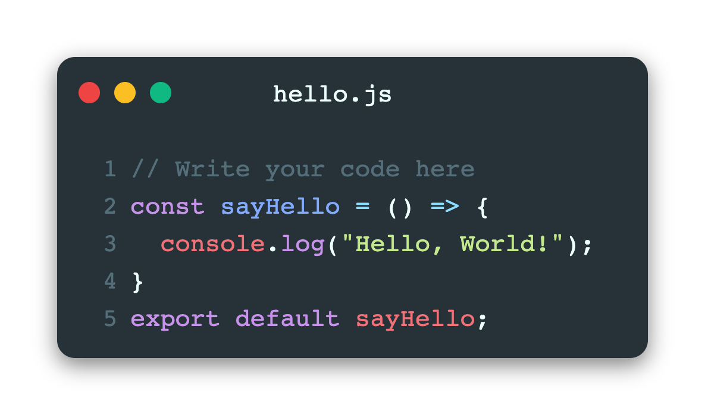
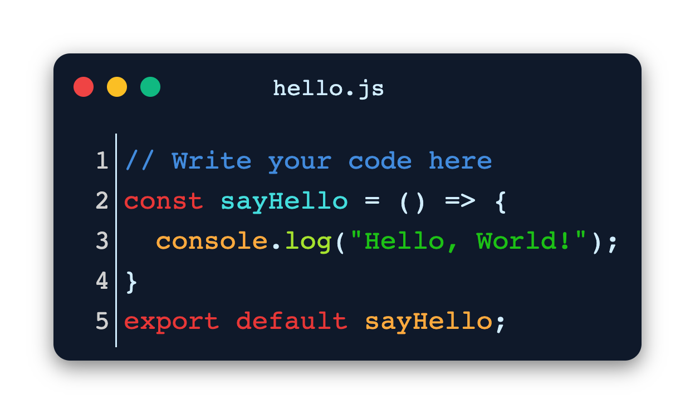

  <h1 align="center">Code To Image Converter</h1>

  

    A code to image converter where you can convert your codes to beautiful images which you can share online
     
     
    <a href="https://brandon-gs.com/code-to-image">Visit Now</a>
    ·
    <a href="https://github.com/brandon-gs/code-to-image/issues">Report Bug</a>
    ·
    <a href="https://github.com/brandon-gs/code-to-image/issues">Request Feature</a>
  

<!-- TABLE OF CONTENTS -->

- [About The Project](#about-the-project)
- [Built With](#built-with)

<!-- ABOUT THE PROJECT -->

## About The Project

This is an online code to image converter. You can write code, modify looks, change themes and export that window as a png or jpeg. Then you can share that beautiful image of your code online.

With Transparent Background

## Built With

Because this is a web based game that's why I choose react framework for the UI but you can make it with just simple HTML, CSS and JavaScript.

- React JS
- TypeScript
- SASS
- Tailwindcss
